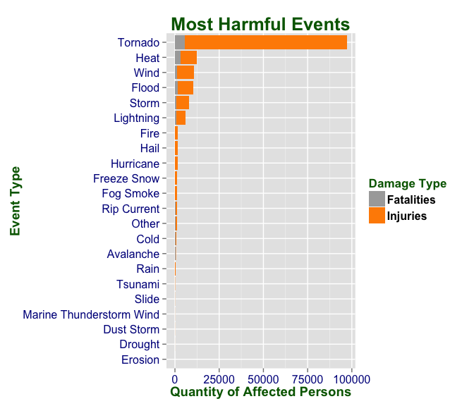
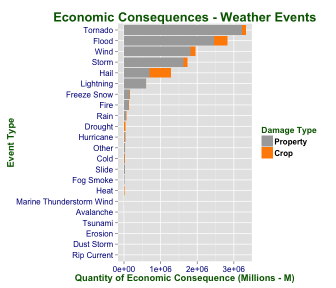

# Weather Events (1950 - 2011): Fatalities, Injuries, and Damage Costs
Oscar Reyes  
April 25, 2015  

#Introduction
Storms and other severe weather events can cause both public health and economic problems to communities and municipalities. Many severe events can result in fatalities, injuries, and property damage, and preventing such outcomes to the extent possible is a key concern.

This project involves exploring the U.S. National Oceanic and Atmospheric Administration's (NOAA) storm database. This database tracks characteristics of major storms and weather events in the United States, including when and where they occur, as well as estimates of any fatalities, injuries, and property damage.      

***

#Synopsis   
This document presents an analysis of the [U.S. National Oceanic and Atmospheric Administration's (NOAA) storm database (1950-2011)]:[47K].  The analysis shows that <code class = "data">Tornados</code>, followed by <code class = "data">Heat</code> and <code class = "data">Wind</code> are the weather events that impact the most population health. And as part of the economic analysis the weather events that most impact the economy in <code class = "data">properties</code> and <code class = "data">crop</code> damages are <code class = "data">Tornado</code>, followed by <code class = "data">Flood</code>, <code class = "data">Wind</code> and <code class = "data">Storms</code>.      
The events in the database start in the year 1950 and end in November 2011. In the earlier years of the database there are generally fewer events recorded, most likely due to a lack of good records. More recent years should be considered more complete.     

***

#Data Processing    
Description and justification about:    

- How the data was loaded into R and processed for analysis.    
- Any data transformation.      
    
##Loading Libraries           


```r
for (package in c("ggplot2", "graphics", "knitr", "lattice", "plyr", "reshape2", "R.oo", "R.utils", "scales", "xtable")) {
        if (!(require(package, character.only = TRUE, quietly = TRUE))) {
                install.packages(package)
                library(package, character.only = TRUE)
        }
}
```

##Loading DataBase Information (Raw Data)      


```r
# Variables
main_dir <- "~"
main_folder <- "activity_PA2"
folder <- "Raw Data"
img <- "img"
img_path <- "~/activity_PA2/img"
activity_zip <- "activity.zip"
activity_csv <- "activity.csv"
file_url <- "http://d396qusza40orc.cloudfront.net/repdata/data/StormData.csv.bz2"
setwd (main_dir)

# Validate and create directory
if (!file.exists (main_folder)) {
        dir.create (main_folder)
        setwd (main_folder)
        if (!file.exists (folder)){
                dir.create (folder)
                dir.create (img)
        }
        setwd (folder)

        # Validate if activity.zip and activity.zip files exist, if not download the .zip file
        if (!file.exists (activity_csv)) {
                # Download the file
                download.file (url = file_url,
                               destfile = activity_csv,
                               method = "auto"
                )
                #unzip (activity_zip)
        }
} else {
        # Setting the working directory
        setwd (main_folder)
        setwd (folder)

        # Validate if activity.zip and activity.zip files exist, if not download the .zip file
        if (!file.exists (activity_csv)) {
                # Download the file
                download.file (url = file_url,
                               destfile = activity_csv,
                               method = "auto"
                )
                #unzip (activity_zip)
        }
}

setwd (main_dir)
setwd (main_folder)
```
     
     
Loading information from data source:       


```r
# Loading and Processing the Data

# Load the info into a data.frame (info_activity)
## Load the info into a data.frame (info_activity)
all_info_activity <- read.csv (file.path (folder ,activity_csv),
                           header = TRUE,
                           sep = ",",
                           dec = ".",
                           stringsAsFactors = FALSE,
                           strip.white = TRUE
                           )
```
      
      
Inspecting data structure:       


```r
# Verifying Data
# Structure of data.frame (info_activity) --> str (info_activity)
str (all_info_activity)
```

```
## 'data.frame':	902297 obs. of  37 variables:
##  $ STATE__   : num  1 1 1 1 1 1 1 1 1 1 ...
##  $ BGN_DATE  : chr  "4/18/1950 0:00:00" "4/18/1950 0:00:00" "2/20/1951 0:00:00" "6/8/1951 0:00:00" ...
##  $ BGN_TIME  : chr  "0130" "0145" "1600" "0900" ...
##  $ TIME_ZONE : chr  "CST" "CST" "CST" "CST" ...
##  $ COUNTY    : num  97 3 57 89 43 77 9 123 125 57 ...
##  $ COUNTYNAME: chr  "MOBILE" "BALDWIN" "FAYETTE" "MADISON" ...
##  $ STATE     : chr  "AL" "AL" "AL" "AL" ...
##  $ EVTYPE    : chr  "TORNADO" "TORNADO" "TORNADO" "TORNADO" ...
##  $ BGN_RANGE : num  0 0 0 0 0 0 0 0 0 0 ...
##  $ BGN_AZI   : chr  "" "" "" "" ...
##  $ BGN_LOCATI: chr  "" "" "" "" ...
##  $ END_DATE  : chr  "" "" "" "" ...
##  $ END_TIME  : chr  "" "" "" "" ...
##  $ COUNTY_END: num  0 0 0 0 0 0 0 0 0 0 ...
##  $ COUNTYENDN: logi  NA NA NA NA NA NA ...
##  $ END_RANGE : num  0 0 0 0 0 0 0 0 0 0 ...
##  $ END_AZI   : chr  "" "" "" "" ...
##  $ END_LOCATI: chr  "" "" "" "" ...
##  $ LENGTH    : num  14 2 0.1 0 0 1.5 1.5 0 3.3 2.3 ...
##  $ WIDTH     : num  100 150 123 100 150 177 33 33 100 100 ...
##  $ F         : int  3 2 2 2 2 2 2 1 3 3 ...
##  $ MAG       : num  0 0 0 0 0 0 0 0 0 0 ...
##  $ FATALITIES: num  0 0 0 0 0 0 0 0 1 0 ...
##  $ INJURIES  : num  15 0 2 2 2 6 1 0 14 0 ...
##  $ PROPDMG   : num  25 2.5 25 2.5 2.5 2.5 2.5 2.5 25 25 ...
##  $ PROPDMGEXP: chr  "K" "K" "K" "K" ...
##  $ CROPDMG   : num  0 0 0 0 0 0 0 0 0 0 ...
##  $ CROPDMGEXP: chr  "" "" "" "" ...
##  $ WFO       : chr  "" "" "" "" ...
##  $ STATEOFFIC: chr  "" "" "" "" ...
##  $ ZONENAMES : chr  "" "" "" "" ...
##  $ LATITUDE  : num  3040 3042 3340 3458 3412 ...
##  $ LONGITUDE : num  8812 8755 8742 8626 8642 ...
##  $ LATITUDE_E: num  3051 0 0 0 0 ...
##  $ LONGITUDE_: num  8806 0 0 0 0 ...
##  $ REMARKS   : chr  "" "" "" "" ...
##  $ REFNUM    : num  1 2 3 4 5 6 7 8 9 10 ...
```

```r
# Column names
names (all_info_activity)
```

```
##  [1] "STATE__"    "BGN_DATE"   "BGN_TIME"   "TIME_ZONE"  "COUNTY"    
##  [6] "COUNTYNAME" "STATE"      "EVTYPE"     "BGN_RANGE"  "BGN_AZI"   
## [11] "BGN_LOCATI" "END_DATE"   "END_TIME"   "COUNTY_END" "COUNTYENDN"
## [16] "END_RANGE"  "END_AZI"    "END_LOCATI" "LENGTH"     "WIDTH"     
## [21] "F"          "MAG"        "FATALITIES" "INJURIES"   "PROPDMG"   
## [26] "PROPDMGEXP" "CROPDMG"    "CROPDMGEXP" "WFO"        "STATEOFFIC"
## [31] "ZONENAMES"  "LATITUDE"   "LONGITUDE"  "LATITUDE_E" "LONGITUDE_"
## [36] "REMARKS"    "REFNUM"
```

```r
# Data dimmensions
dim (all_info_activity)
```

```
## [1] 902297     37
```
     
     
##Cleaning, Standardizing and Processing Data
The <code class = "data">Data Set</code> contains <code class = "data">902297 observations </code> and <code class = "data">37 variables</code>.   

### Select only the required variables/data
For the actual analysis are required some variables:    

<table class = "tg">
<thead>
<tr>
<th class="tg-031e">**Variable**</th>
<th class="tg-031e">**Description**</th>
</tr>
</thead>
<tbody>
<tr>
<th class="tg-031e"><code class = "data">STATE</code></th> 
<th class="tg-031e">State where the event occurred.  Abbreviations of US States.</th>
</tr>
<tr>
<th class="tg-031e"><code class = "data">EVTYPE</code></th> 
<th class="tg-031e">Event Type (E.g. Tornado, Flood, Storm, Hurricane, Hail, etc...).</th>
</tr>
<tr>
<th class="tg-031e"><code class = "data">FATALITIES</code></th> 
<th class="tg-031e">Total number of fatalities assigned to (or caused by) this event. Leave blank for zero amounts.</th>
</tr>
<tr>
<th class="tg-031e"><code class = "data">INJURIES</code></th> 
<th class="tg-031e">Total number of injuries assigned to (or caused by) this event. Leave blank for zero amounts.</th>
</tr>
<tr>
<th class="tg-031e"><code class = "data">PROPDMG</code></th> 
<th class="tg-031e">Total Property Damage assigned to (or caused by) this event in abbreviated dollar amounts according to WSOM Chapter F-42.</th>
</tr>
<tr>
<th class="tg-031e"><code class = "data">PROPDMGEXP</code></th> 
<th class="tg-031e">Multiplier letter, e.g., K, M, B, etc.  Unit of damage (B, M, K, H).</th>
</tr>
<tr>
<th class="tg-031e"><code class = "data">CROPDMG</code></th> 
<th class="tg-031e">Total Crop Damage assigned to (or caused by) this event in abbreviated dollar amounts according to WSOM Chapter F-42.</th>
</tr>
<tr>
<th class="tg-031e"><code class = "data">CROPDMGEXP</code></th> 
<th class="tg-031e">Multiplier letter, e.g., K, M, B, etc. Unit of crop damage (B, M, K, H).</th>
</tr>
</tbody>
</table>    
       
       
Subsetting the source data and extracting only required variables:     


```r
variables_activity <- c("EVTYPE",
                        "FATALITIES",
                        "INJURIES",
                        "PROPDMG",
                        "PROPDMGEXP",
                        "CROPDMG",
                        "CROPDMGEXP",
                        "STATE",
                        "REFNUM")

info_activity <- data.frame (subset (all_info_activity,
                                     subset = nrow (all_info_activity) >0,
                                     select = variables_activity))

length_variables_activity <- length (variables_activity)
all_info_activity <- info_activity

str (info_activity)
```

```
## 'data.frame':	902297 obs. of  9 variables:
##  $ EVTYPE    : chr  "TORNADO" "TORNADO" "TORNADO" "TORNADO" ...
##  $ FATALITIES: num  0 0 0 0 0 0 0 0 1 0 ...
##  $ INJURIES  : num  15 0 2 2 2 6 1 0 14 0 ...
##  $ PROPDMG   : num  25 2.5 25 2.5 2.5 2.5 2.5 2.5 25 25 ...
##  $ PROPDMGEXP: chr  "K" "K" "K" "K" ...
##  $ CROPDMG   : num  0 0 0 0 0 0 0 0 0 0 ...
##  $ CROPDMGEXP: chr  "" "" "" "" ...
##  $ STATE     : chr  "AL" "AL" "AL" "AL" ...
##  $ REFNUM    : num  1 2 3 4 5 6 7 8 9 10 ...
```

```r
names (info_activity)
```

```
## [1] "EVTYPE"     "FATALITIES" "INJURIES"   "PROPDMG"    "PROPDMGEXP"
## [6] "CROPDMG"    "CROPDMGEXP" "STATE"      "REFNUM"
```
      
      
### Unifying event types     

List of proposed Data Events and Actual Data Events (Directive NWS 10-1605):    


<table class = "tg">
<thead>
<tr>
<th>Proposed Data Event Table</th>
<th>Actual Storm Data Event Table - NWS Directive 10-1605</th>
</tr>
</thead>
<tbody>
<tr>
<th>Avalanche</th> 
<th>Avalanche, Debris Flow</th>
</tr>
<tr>
<th>Cold</th> 
<th>Cold, Extreme Cold</th>
</tr>
<tr>
<th>Drought</th> 
<th>Drought</th>
</tr>
<tr>
<th>Dust Storm</th> 
<th>Dust Devil, Dust Storm, DustStorm</th>
</tr>
<tr>
<th>Erosion</th> 
<th>Erosion</th>
</tr>
<tr>
<th>Fire</th> 
<th>Fire Wild</th>
</tr>
<tr>
<th>Fog Smoke</th> 
<th>Dense Fog, Dense Smoke, Fog, Freezing Fog, Smoke</th>
</tr>
<tr>
<th>Flood</th> 
<th>Coastal Flood, CoastalFlood, Fast Flood, Flood, Lakeshore Flood, River Flood</th>
</tr>
<tr>
<th>Hail</th> 
<th>Hail</th>
</tr>
<tr>
<th>Heat</th> 
<th>Excessive, Excessive Heat, Heat</th>
</tr>
<tr>
<th>Hurricane</th> 
<th>Hurricaine, Typhoon</th>
</tr>
<tr>
<th>Freeze Snow</th> 
<th>Freeze, Frost, Frost/Freeze, Heavy Snow, Lake Effect Snow, Lake-Effect Snow, Sleet, Snow</th>
</tr>
<tr>
<th>Lightning</th> 
<th>Lightning</th>
</tr>
<tr>
<th>Marine Thunderstorm Wind</th> 
<th>Marine Hail, Marine High Wind, Marine Strong Wind, Marine Thunderstorm Wind, Thunderstorm Wind</th>
</tr>
<tr>
<th>Rain</th> 
<th>Heavy Rain, Rain</th>
</tr>
<tr>
<th>Rip Current</th> 
<th>Rip Current</th>
</tr>
<tr>
<th>Slide</th> 
<th>Slide, Earth Slide</th>
</tr>
<tr>
<th>Storm</th> 
<th>Coastal Storm, CoastalStorm, Dust Storm, DustStorm, Ice, Ice Storm, Storm Surge, Storm Surge/Tide, Storm Tide, Thunderstorm, Tropical storm, Winter Storm, Winter Weather</th>
</tr>
<tr>
<th>Tsunami</th> 
<th>Tsunami</th>
</tr>
<tr>
<th>Tornado</th> 
<th>Funnel, Funnel Cloud, Tornado, Waterspout</th>
</tr>
<tr>
<th>Wind</th> 
<th>Blizzard, High Wind, High, Strong Wind, Wind, Wind Chill</th>
</tr>
<tr>
<th>Other</th> 
<th>Other values/variables.</th>
</tr>
</tbody>
</table>    


Creating new dataset:       


```r
new_events_type <- c ("Flood",
                      "Storm",
                      "Tsunami",
                      "Hurricane",
                      "Tornado",
                      "Avalanche",
                      "Slide",
                      "Cold",
                      "Drought",
                      "Dust Storm",
                      "Erosion",
                      "Fire",
                      "Fog Smoke",
                      "Hail",
                      "Heat",
                      "Freeze Snow",
                      "Lightning",
                      "Marine Thunderstorm Wind",
                      "Rain",
                      "Rip Current",
                      "Wind",
                      "Other")

aux_variables_activity = c("evtype",
                           "fatalities",
                           "injuries",
                           "propdmg",
                           "propdmgexp",
                           "cropdmg",
                           "cropdmgexp",
                           "state",
                           "refnum")

length_new_events_type <- length (new_events_type)
length_aux_variables_activity <- length (aux_variables_activity)

aux_activity <- setNames (data.frame (matrix (ncol = length_aux_variables_activity,
                                              nrow = length (new_events_type))),
                          paste0 (aux_variables_activity))

for (p in 1:length_new_events_type) {
        aux_activity$evtype[p] = new_events_type[p]
        aux_activity$fatalities[p] = 0
        aux_activity$injuries[p] = 0
        aux_activity$propdmg[p] = 0
        aux_activity$propdmgexp[p] = c("")
        aux_activity$cropdmg[p] = 0
        aux_activity$cropdmgexp[p] = c("")
}

actual_events_type <- c ("FLOOD|FLD",
                         "STORM|WINTER",
                         "TSUNAMI",
                         "HURRICANE|TYPHON",
                         "FUNNEL|TORNADO|WATERSPOUT",
                         "AVALANCHE|DEBRIS",
                         "SLIDE",
                         "COLD|LOW TEMPERATURE",
                         "DROUGHT",
                         "DUST",
                         "EROSION|EROSIN",
                         "FIRE|WILDFIRE|FOREST FIRE|WILDFIRES",
                         "FOG|SMOKE",
                         "HAIL",
                         "EXCESSIVE|HEAT",
                         "FREEZE|FROST|SNOW|SLEET",
                         "LIGHTNING",
                         "MARINE|THUNDERSTORM WIND",
                         "RAIN",
                         "RIP",
                         "BLIZZARD|WIND|MICROBURST")
```
       
       
###Unit Multipliers     

This identifier appears on <code class = "data">PROPDMGEXP</code> and <code class = "data">CROPDMGEXP</code> as unit in US Dollars:     


<table class = "tg">
<thead>
<tr>
<th class="tg-031e">**Variable**</th>
<th class="tg-031e">**Description**</th>
</tr>
</thead>
<tbody>
<tr>
<th class="tg-031e"><code class = "data">B</code></th>  
<th class="tg-031e">Billions</th>
</tr>
<tr>
<th class="tg-031e"><code class = "data">M</code></th>
<th class="tg-031e">Millions</th>
</tr>
<tr>
<th class="tg-031e"><code class = "data">K</code></th>
<th class="tg-031e">Thousands</th>
</tr>
<tr>
<th class="tg-031e"><code class = "data">H</code></th>
<th class="tg-031e">Hundreds</th>
</tr>
<tr>
<th class="tg-031e"><code class = "data"><empty></code></th>
<th class="tg-031e">None</th></tr>
</tbody>
</table>   
    

> **NOTE**: In this analysis the amount in US Dollars for costs will be standardized to Millions.       
      


```r
# Transform to uppercase all EVTYPE events and to Thousands PROPDMG and CROPDMG to Millions
all_info_activity$EVTYPE <- toupper (info_activity$EVTYPE)
all_info_activity$PROPDMGEXP <- toupper (info_activity$PROPDMGEXP)
all_info_activity$CROPDMGEXP <- toupper (info_activity$CROPDMGEXP)

nrow_info_activity <- nrow (all_info_activity)
names (all_info_activity)
```

```
## [1] "EVTYPE"     "FATALITIES" "INJURIES"   "PROPDMG"    "PROPDMGEXP"
## [6] "CROPDMG"    "CROPDMGEXP" "STATE"      "REFNUM"
```

```r
table_values_letters <- c ("B",
                           "M",
                           "K",
                           "H",
                           "")

table_values <- c (1000,
                   1,
                   0.001,
                   0.0001,
                   0.000001)

length_table_values <- length (table_values)

temp_info_activity <- all_info_activity

# STANDARDIZING to Millions - PROPDMG

temp_info_activity$ids <- grep ("",
                                temp_info_activity$PROPDMGEXP)

for ( i in 1 : length_table_values) {

        aux_info_activity <- grep (table_values_letters [i],
                                   temp_info_activity$PROPDMGEXP)

        ids_activity <- temp_info_activity$ids [aux_info_activity]

        all_info_activity$PROPDMG[ids_activity] <- lapply (all_info_activity$PROPDMG [ids_activity],
                                                           function(x) x*table_values [i])

        temp_info_activity <- temp_info_activity[-aux_info_activity,]
}

all_info_activity$PROPDMG <- as.numeric (info_activity$PROPDMG)
all_info_activity$CROPDMG <- as.numeric (info_activity$CROPDMG)

# STANDARDIZING to Millions - CROPDMG

temp_info_activity$ids <- grep ("",
                                temp_info_activity$CROPDMGEXP)

for ( i in 1 : length_table_values) {

        aux_info_activity <- grep (table_values_letters [i],
                                   temp_info_activity$CROPDMGEXP)

        ids_activity <- temp_info_activity$ids [aux_info_activity]

        all_info_activity$CROPDMG[ids_activity] <- lapply (all_info_activity$CROPDMG [ids_activity],
                                                           function(x) x*table_values [i])

        temp_info_activity <- temp_info_activity[-aux_info_activity,]
}
all_info_activity$PROPDMG <- as.numeric (info_activity$PROPDMG)
all_info_activity$CROPDMG <- as.numeric (info_activity$CROPDMG)

info_activity <- all_info_activity
```
    
    
Verifying if <code class = "data">NA</code>'s are present in the dataset:       


```r
### Verifying NAs (missing data)
total_NAs <- sum (is.na (info_activity))
total_NAs
```

```
## [1] 0
```
        
        
> **Note**: Not <code class = "data">NA</code>'s are present on the dataframe.      


###Joining Variables Activity to Proposed Data Events           
   
Each variable type is grouped into the designated group according to the Proposed Data Events Sctructure, as shown before.


```r
length_actual_events_type <- length (actual_events_type)
nrow_info_activity <- nrow (info_activity)
aux_activity2 <- info_activity

for (i in 1 : length_actual_events_type) {

        aux_activity_ids <- grep (actual_events_type[i],
                                  aux_activity2$EVTYPE,
                                  value = FALSE,
                                  useBytes = TRUE)

        length_aux_activity_ids <- length (aux_activity_ids)

        aux_activity$fatalities[i] <- sum (aux_activity2$FATALITIES[aux_activity_ids])
        aux_activity$injuries[i] <- sum (aux_activity2$INJURIES[aux_activity_ids])
        aux_activity$propdmg[i] <- sum (aux_activity2$PROPDMG[aux_activity_ids])
        aux_activity$cropdmg[i] <- sum (aux_activity2$CROPDMG[aux_activity_ids])

        aux_activity2 <- aux_activity2[-aux_activity_ids,]
}

Other <- length_new_events_type
aux_activity$fatalities[Other] <- sum (aux_activity2$FATALITIES)
aux_activity$injuries[Other] <- sum (aux_activity2$INJURIES)
aux_activity$propdmg[Other] <- sum (aux_activity2$PROPDMG)
aux_activity$cropdmg[Other] <- sum (aux_activity2$CROPDMG)

nrow_aux_activity <- nrow (aux_activity)
```
     
***

#Results       

Mains results presented.      

Evaluating all information, after Cleaning, Standardizing and Processing Data, all information has been printed in a bar graph.  Two graphs have been printed:      
   
- Most Harmful Events to Population Health (1950 - 2011).     
- Economic Consequences - Weather Events (1950 - 2011).     
    
    
##Most Harmful Events to Population Health (1950 - 2011)     
    
In this graph is possible to identify the most harmful weather events that affected the Population since 1950 until 2011.     
    
####Table with Most Harmful Events
    

```r
detailed_HE_DF <- subset (aux_activity, select = c (evtype, fatalities, injuries))
colnames (detailed_HE_DF) <- c ("Event Type", "Fatalities", "Injuries")

print (detailed_HE_DF[with (detailed_HE_DF, order (-Fatalities, -Injuries)),],
       comment = FALSE,
       include.rownames = FALSE,
       type = "html")
```

```
##                  Event Type Fatalities Injuries
## 5                   Tornado       5664    91439
## 15                     Heat       3134     9232
## 1                     Flood       1553     8683
## 21                     Wind       1061     9668
## 17                Lightning        817     5231
## 2                     Storm        694     7228
## 20              Rip Current        577      529
## 8                      Cold        458      320
## 22                    Other        257      817
## 6                 Avalanche        224      171
## 16              Freeze Snow        158     1166
## 4                 Hurricane        135     1328
## 19                     Rain        106      282
## 12                     Fire         90     1608
## 13                Fog Smoke         80     1076
## 7                     Slide         44       55
## 3                   Tsunami         33      129
## 18 Marine Thunderstorm Wind         32       38
## 14                     Hail         20     1466
## 9                   Drought          6       19
## 10               Dust Storm          2       43
## 11                  Erosion          0        0
```
       
       


```r
fatalities_injuries_vector <- aggregate (cbind (fatalities, injuries) ~ evtype,
                                         aux_activity,
                                         FUN = sum)

fatalities_injuries_toplot <- melt (head(fatalities_injuries_vector[order (-fatalities_injuries_vector$fatalities,
                                                                           -fatalities_injuries_vector$injuries),],
                                         nrow_aux_activity))
```

```
## Using evtype as id variables
```

```r
colnames (fatalities_injuries_toplot) <- c ("event_type",
                                            "fatalities_injuries",
                                            "value")

ggplot (fatalities_injuries_toplot,
        aes (x = reorder (event_type,
                          value),
             y = value,
             fill = factor (fatalities_injuries,
                            labels = c("Fatalities",
                                       "Injuries")))) +
        geom_bar (stat = "identity") +
        labs (title = "Most Harmful Events",
              x = "Event Type",
              y = "Quantity of Affected Persons") +
        scale_fill_manual (values = c ("darkgray",
                                       "darkorange")) +
        guides (fill = guide_legend (title = "Damage Type")) +
        xlab ("Event Type") +
        theme (axis.text = element_text (size = 12,
                                         colour = "darkblue"),
               axis.title = element_text (size = 14,
                                          colour = "darkgreen",
                                          face = "bold"),
               title = element_text (size = 16,
                                     colour = "darkgreen",
                                     face = "bold"),
               legend.text = element_text (size = 12,
                                           colour = "black",
                                           face = "bold")) +
        coord_flip ()
```

 
   
       
According to the bar graph the most harmful events to the population are:


<table class = "tg">
<thead>
<tr>
<th>Position</th>
<th>Proposed Data Event Table</th>
<th>Actual Storm Data Event Table - NWS Directive 10-1605</th>
</tr>
</thead>
<tbody>

<tr>
<th>**1.**</th>
<th>Tornado</th> 
<th>Funnel, Funnel Cloud, Tornado, Waterspout.</th>
</tr>

<tr>
<th>**2.**</th>
<th>Heat</th> 
<th>Excessive, Excessive Heat, Heat.</th>
</tr>

<tr>
<th>**3.**</th>
<th>Wind</th> 
<th>
Blizzard, High Wind, High, Strong Wind, Wind, Wind Chill.
</th>

<tr>
<th>**4.**</th>
<th>Flood</th> 
<th>
Coastal Flood, CoastalFlood, Fast Flood, Flood, Lakeshore Flood, River Flood, Other flood.
</th>
</tr>

<tr>
<th>**5.**</th>
<th>Storm</th> 
<th>
Coastal Storm, CoastalStorm, Dust Storm, DustStorm, Ice, Ice Storm, Storm Surge, Storm Surge/Tide, Storm Tide, Thunderstorm, Tropical storm, Winter Storm, Winter Weather.
</th>
</tr>

</tr>

<tr>
<th>**6.**</th>
<th>Lightning</th> 
<th>
Lightning. 
</th>
</tr>

<tr>
<th>**7.**</th>
<th>Fire</th> 
<th>Fire, Forest Fire</th>
</tr>
</tbody>
</table>     

   
##Events that have greatest economic consequences (1950 - 2011)      
      
      
###Table with Weather Events with More Economic Consequences

```r
detailed_EC_DF <- subset (aux_activity, select = c (evtype, propdmg, cropdmg))
colnames (detailed_EC_DF) <- c ("Event Type", "Property_Damages", "Crop_Damages")


print (detailed_EC_DF[with (detailed_EC_DF, order (-Property_Damages, -Crop_Damages)),],
       comment = FALSE,
       include.rownames = FALSE,
       type = "html")
```

```
##                  Event Type Property_Damages Crop_Damages
## 5                   Tornado       3225508.81    100029.27
## 1                     Flood       2462183.45    367300.53
## 21                     Wind       1815584.29    130641.81
## 2                     Storm       1630173.03     99415.69
## 14                     Hail        697962.28    585825.16
## 17                Lightning        603499.78      3580.61
## 16              Freeze Snow        150153.65     11816.13
## 12                     Fire        125223.29      9565.74
## 19                     Rain         56882.94     12457.30
## 22                    Other         24088.82      1876.75
## 4                 Hurricane         23757.25     10812.79
## 7                     Slide         20193.04        37.00
## 13                Fog Smoke         17359.26         0.00
## 8                      Cold         15171.04      8934.74
## 15                     Heat          4967.86      1559.40
## 9                   Drought          4299.05     33954.40
## 18 Marine Thunderstorm Wind          3190.34         0.00
## 6                 Avalanche          1628.90         0.00
## 3                   Tsunami           905.30        20.00
## 11                  Erosion           866.00         0.00
## 10               Dust Storm           738.63         0.00
## 20              Rip Current           163.00         0.00
```
     
     


```r
prop_crop_dmg_vector <- aggregate (cbind (propdmg, cropdmg) ~ evtype,
                                         aux_activity,
                                         FUN = sum)

prop_crop_dmg_toplot <- melt (head(prop_crop_dmg_vector[order (-prop_crop_dmg_vector$propdmg,
                                                               -prop_crop_dmg_vector$cropdmg),],
                                         nrow_aux_activity))
```

```
## Using evtype as id variables
```

```r
colnames (prop_crop_dmg_toplot) <- c ("event_type",
                                            "Property_Crop",
                                            "value")

ggplot (prop_crop_dmg_toplot,
        aes (x = reorder (event_type,
                          value),
             y = value,
             fill = factor (Property_Crop,
                            labels = c("Property",
                                       "Crop")))) +
        geom_bar (stat = "identity") +
        labs (title = "Economic Consequences - Weather Events",
              x = "Event Type",
              y = "Quantity of Economic Consequence (Millions - M)") +
        scale_fill_manual (values = c ("darkgray",
                                       "darkorange")) +
        guides (fill = guide_legend (title = "Damage Type")) +
        xlab ("Event Type") +
        theme (axis.text = element_text (size = 12,
                                         colour = "darkblue"),
               axis.title = element_text (size = 14,
                                          colour = "darkgreen",
                                          face = "bold"),
               title = element_text (size = 16,
                                     colour = "darkgreen",
                                     face = "bold"),
               legend.text = element_text (size = 12,
                                           colour = "black",
                                           face = "bold")) +
        coord_flip ()
```

 
       
       
According to the bar graph the weather events with most Economic Consequences are:

<table class = "tg">
<thead>
<tr>
<th>Position</th>
<th>Proposed Data Event Table</th>
<th>Actual Storm Data Event Table - NWS Directive 10-1605</th>
</tr>
</thead>
<tbody>

<tr>
<th>**1.**</th>
<th>Tornado</th> 
<th>Funne, Funnel Cloud, Tornado, Waterspout.</th>
</tr>

<tr>
<th>**2.**</th>
<th>Flood</th> 
<th>
Coastal Flood, CoastalFlood, Fast Flood, Flood, Lakeshore Flood, River Flood, Other flood.
</th>
</tr>

<tr>
<th>**3.**</th>
<th>Wind</th> 
<th>
Blizzard, High Wind, High, Strong Wind, Wind, Wind Chill.
</th>

<tr>
<th>**4.**</th>
<th>Storm</th> 
<th>
Coastal Storm, CoastalStorm, Dust Storm, DustStorm, Ice, Ice Storm, Storm Surge, Storm Surge/Tide, Storm Tide, Thunderstorm, Tropical storm, Winter Storm, Winter Weather.
</th>
</tr>

<tr>
<th>**5.**</th>
<th>Hail</th>
<th>Hail.</th>
</tr>

<tr>
<th>**6.**</th>
<th>Lightning</th> 
<th>
Lightning.
</th>
</tr>

<tr>
<th>**7.**</th>
<th>Freze Snow</th> 
<th>
Freeze, Frost, Frost/Freeze, Heavy Snow, Lake Effect Snow, Lake-Effect Snow, Sleet, Snow. 
</th>
</tr>

</tbody>
</table>     
       
#Links & Sources

- [U.S. National Oceanic and Atmospheric Administration's (NOAA) storm database (1950-2011)]:[47K].     
- [Storm Data Documentation].     
- [Storm Data FAQ].     
- [NOAA Storm Events Database].     

#Session and Language
   
<table class = "tg">
<thead>
<tr>
<th>Language</th>
<th>Platform</th>
<th>Version</th>
</tr>
</thead>
<tbody>
<tr>
<th>R</th>
<th>RStudio</th> 
<th>Version 0.98.1103 – © 2009-2014 RStudio</th>
</tr>
</tbody>
</table>    

> **Note**:  The languge used to create this document is <code class = "data">R Markdown</code>.

#Session Information

```r
sessionInfo()
```

```
## R version 3.1.3 (2015-03-09)
## Platform: x86_64-apple-darwin13.4.0 (64-bit)
## Running under: OS X 10.10.3 (Yosemite)
## 
## locale:
## [1] en_US.UTF-8/en_US.UTF-8/en_US.UTF-8/C/en_US.UTF-8/en_US.UTF-8
## 
## attached base packages:
## [1] stats     graphics  grDevices utils     datasets  methods   base     
## 
## other attached packages:
##  [1] xtable_1.7-4      scales_0.2.4      reshape2_1.4.1   
##  [4] plyr_1.8.1        lattice_0.20-30   knitr_1.9        
##  [7] ggplot2_1.0.1     R.utils_2.0.0     R.oo_1.19.0      
## [10] R.methodsS3_1.7.0
## 
## loaded via a namespace (and not attached):
##  [1] colorspace_1.2-6 digest_0.6.8     evaluate_0.5.5   formatR_1.0     
##  [5] grid_3.1.3       gtable_0.1.2     htmltools_0.2.6  labeling_0.3    
##  [9] MASS_7.3-40      munsell_0.4.2    proto_0.3-10     Rcpp_0.11.5     
## [13] rmarkdown_0.5.1  stringr_0.6.2    tools_3.1.3      yaml_2.1.13
```

[U.S. National Oceanic and Atmospheric Administration's (NOAA) storm database (1950-2011)]: https://d396qusza40orc.cloudfront.net/repdata%2Fdata%2FStormData.csv.bz2    "NOAA Storm DataBase"
[Storm Data Documentation]: https://d396qusza40orc.cloudfront.net/repdata%2Fpeer2_doc%2Fpd01016005curr.pdf    "Storm Data Documentation"     
[Storm Data FAQ]: https://www.ncdc.noaa.gov/stormevents/faq.jsp     "Storm Data FAQ"
[NOAA Storm Events Database]: https://www.ncdc.noaa.gov/stormevents/     "Storm Events Database"
    
******      
     
> **Note**: All `echo = TRUE` parameter was added to the code chunk to let someone else can read the code.
